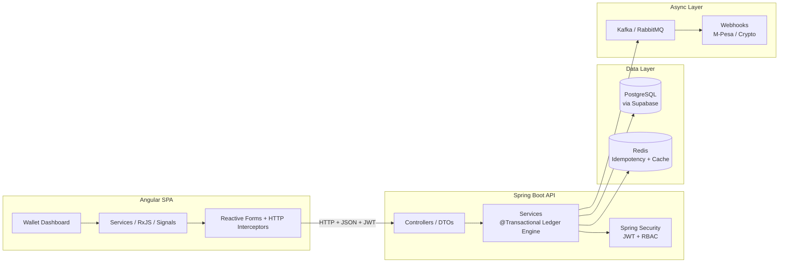
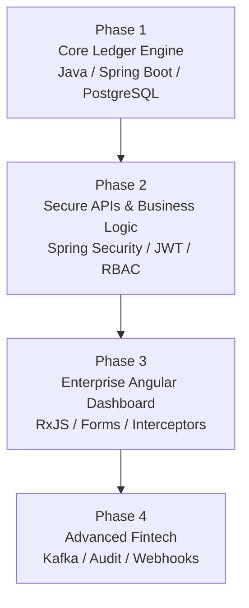
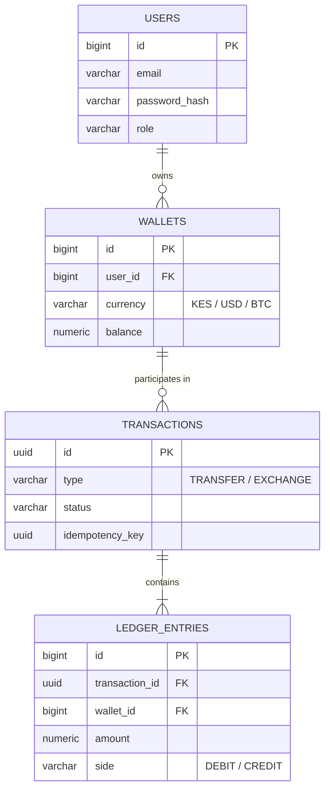
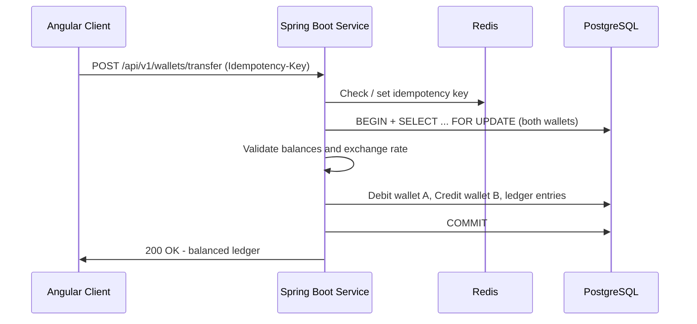
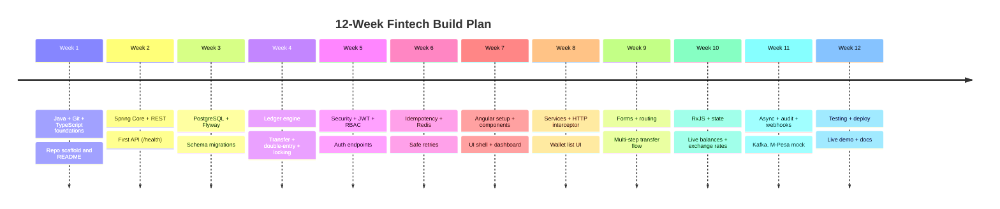

# EliteWallet - Fintech System


> A full-stack fintech platform: a **Spring Boot** REST API + ledger engine (**Java**) and an **Angular** enterprise dashboard (**TypeScript**), backed by PostgreSQL. The working React prototype that defined the product experience is preserved in git history. The learning path follows the official [roadmap.sh](https://roadmap.sh/dashboard) tracks for [Spring Boot](https://roadmap.sh/spring-boot) and [Angular](https://roadmap.sh/angular), applied to a real financial product.

EliteWallet is a learning-by-building project: instead of learning Spring Boot and Angular in isolation, we build a real fintech platform step by step - multi-currency wallets (KES, USD, BTC), a double-entry ledger, JWT security, dashboards, and async integrations like M-Pesa webhooks.

---

## Table of Contents

- [Project Overview](#project-overview)
- [Architecture at a Glance](#architecture-at-a-glance)
- [Tech Stack](#tech-stack)
- [Database & Architecture Decisions](#database--architecture-decisions)
- [Repository Structure](#repository-structure)
- [Getting Started](#getting-started)
- [Learning Roadmap](#learning-roadmap)
- [Full-Stack Milestones](#full-stack-milestones)
- [12-Week Plan](#12-week-plan)
- [Progress Tracking](#progress-tracking)
- [Publishing to GitHub](#publishing-to-github)
- [License](#license)

---

## Project Overview

The system has two halves:

- **Frontend** - an Angular 21 SPA (TypeScript) that will consume the API: wallet dashboard, transfers, exchange, portfolio summaries, and admin screens. The React prototype that shaped the UX is preserved in git history.
- **Backend (in progress)** - a Spring Boot REST API that owns all business logic: the core ledger engine, JWT authentication with role-based access control, idempotent transfer endpoints, and async jobs.

The guiding principle: **Spring Boot owns the money.** No client-side database writes, no business rules in the browser - the API is the only path to the ledger.

## Frontend (Angular)

The repository frontend is an **Angular 21** SPA (TypeScript) implementing the live wallet UI:
registration/login, dashboard with multi-asset balances and live rates, M-Pesa and
crypto deposit/withdrawal pages, and a full transaction history.

> The complete **React + Vite** prototype (EliteWallet) that defined the wallet
experience (20+ pages, mock services, M-Pesa STK Push demo) is preserved in git
history (commit `5963b7f`) and in `Joywallet/prototype-react` — it can be restored
at any time.

The REST contract the API implements is defined in
[frontend/docs/backend-api-contract.md](frontend/docs/backend-api-contract.md), with staged
Angular + Spring Boot conversion prompts in
[frontend/docs/vscode-ai-prompts.md](frontend/docs/vscode-ai-prompts.md).

## Transactional Wallet (Implemented)

The wallet engine is live in `backend/` and wired to the Angular frontend:

- **Auth** — JWT register/login (`POST /api/v1/auth/register`, `POST /api/v1/auth/login`, `GET /api/v1/auth/me`)
- **Ledger** — double-entry `ledger_entries` posted atomically with pessimistic row locks; idempotent per provider reference
- **Deposits** — M-Pesa STK Push (`POST /api/v1/deposits/mpesa`) and crypto demo credits (`POST /api/v1/deposits/crypto`)
- **Withdrawals** — M-Pesa B2C payouts (`POST /api/v1/withdrawals/mpesa`) and crypto demo broadcasts (`POST /api/v1/withdrawals/crypto`), with automatic refunds on failure
- **Webhooks** — `POST /api/v1/webhooks/mpesa/stk-callback`, `POST /api/v1/webhooks/mpesa/b2c-result` (public, idempotent)
- **Assets** — 24 fiat currencies + 22 crypto assets, any of which can hold a balance
- **Rates** — live CoinGecko + open.er-api rates cached 5 minutes with static fallback (`GET /api/v1/rates`)

### M-Pesa setup (sandbox)

Register at the [Daraja developer portal](https://developer.safaricom.co.ke), create an app, then set:

```bash
MPESA_CONSUMER_KEY=...    MPESA_CONSUMER_SECRET=...
MPESA_PASSKEY=...         MPESA_SHORTCODE=174379
MPESA_CALLBACK_URL=https://<your-public-host>/api/v1/webhooks/mpesa/stk-callback
MPESA_B2C_RESULT_URL=https://<your-public-host>/api/v1/webhooks/mpesa/b2c-result
MPESA_B2C_QUEUE_TIMEOUT_URL=https://<your-public-host>/api/v1/webhooks/mpesa/b2c-result
MPESA_INITIATOR_NAME=...  MPESA_SECURITY_CREDENTIAL=...
```

Daraja callbacks must be publicly reachable HTTPS URLs — use ngrok during local development.
Withdrawals (B2C) need an approved initiator + security credential for production.

### Crypto rails

Crypto deposits and withdrawals run in **demo mode** (instant credit / simulated broadcast, clearly
marked in the UI) through the `CryptoRails` interface. For production, implement that interface with
a real provider (BitGo, Coinbase Prime, Blockstream, or a self-hosted node) — the ledger, idempotency,
and UI do not change.

### API overview

| Method | Path | Purpose |
| --- | --- | --- |
| POST | `/api/v1/auth/register` | Create account (JWT returned) |
| POST | `/api/v1/auth/login` | Sign in |
| GET | `/api/v1/auth/me` | Current user |
| GET | `/api/v1/wallets` | Wallet balances |
| GET | `/api/v1/rates` | Live rates for all assets |
| GET | `/api/v1/transactions` | Transaction history |
| POST | `/api/v1/deposits/mpesa` | STK push deposit (KES) |
| POST | `/api/v1/deposits/crypto` | Crypto demo deposit |
| POST | `/api/v1/withdrawals/mpesa` | B2C withdrawal (KES) |
| POST | `/api/v1/withdrawals/crypto` | Crypto demo withdrawal |
| POST | `/api/v1/webhooks/mpesa/stk-callback` | Daraja STK callback |
| POST | `/api/v1/webhooks/mpesa/b2c-result` | Daraja B2C result |
## Architecture at a Glance



## Tech Stack

| Layer | Technology | Why |
| --- | --- | --- |
| Backend | Java 17+, Spring Boot, Spring MVC | REST API + business logic |
| Ledger | Spring Data JPA, Hibernate, Flyway/Liquibase | ORM + versioned schema migrations |
| Database | PostgreSQL (Supabase as managed host) | ACID guarantees, exact `NUMERIC` math, row locking |
| Cache / Idempotency | Redis | Prevents double charges, caches exchange rates |
| Security | Spring Security, JWT, BCrypt | Stateless auth + RBAC |
| Async | Kafka / RabbitMQ | Emails, PDF statements, notifications |
| Frontend | Angular 21, TypeScript, RxJS | Enterprise dashboard SPA (Phase 3) |
| Prototype (history) | React 18, Vite, Tailwind CSS | EliteWallet prototype preserved in git history |
| UI | Tailwind CSS | Component library / styling |
| Tooling | Maven/Gradle, npm, Git, Docker | Build, dependency & deploy |

## Database & Architecture Decisions

### PostgreSQL - yes, the right call

- **ACID guarantees:** multi-currency transfers are atomic - either both the debit and credit happen, or neither does.
- **Exact math precision:** `NUMERIC` prevents floating-point rounding errors on financial values (e.g., fractional crypto amounts like `0.00000001` BTC).
- **Concurrency controls:** row-level pessimistic locking (`SELECT ... FOR UPDATE`) prevents race conditions during simultaneous transfers.

### Supabase - yes as a managed database host

Spring Boot connects directly to Supabase's PostgreSQL database with standard JDBC / Spring Data JPA credentials. You get an enterprise database on cloud infrastructure with automatic backups and a visual SQL browser out of the box.

### Supabase - no for client SDKs / Auth / Realtime

Do **not** use the Supabase client SDKs inside Spring Boot or Angular. In a Java enterprise stack, Spring Boot must own business logic, security, and authentication via **Spring Security + JWT**. Allowing direct client-side database writes would bypass the strict ledger validation rules that keep the books balanced.

## Repository Structure

```text
fintech-stack/
|-- frontend/                    # Angular 21 SPA (TypeScript)
|   |-- src/                     # pages, components, hooks, mock services
|   |-- docs/                    # API contract + Angular/Spring Boot conversion prompts
|   |-- public/
|   `-- package.json
|-- backend/                     # Spring Boot REST API
|   |-- src/main/java/...        # controllers, services, entities, security, ledger
|   |-- src/main/resources/
|   |   |-- db/migration/        # Flyway / Liquibase migrations
|   |   `-- application.yml
|   `-- pom.xml
|-- .gitignore
`-- README.md
```

> The `backend/` folder holds the Spring Boot REST API scaffold from [Milestone 1](#full-stack-milestones).

## Getting Started

### Prerequisites

- JDK 17+
- Node.js 18+ and npm
- Git
- PostgreSQL (local or Supabase) and Redis (Docker recommended)

Pick your operating system below for install commands, then run the app with the Backend / Frontend steps.

### Platform-Specific Setup

#### Ubuntu / Debian (Linux)

```bash
# Update package lists and install the toolchain
sudo apt update
sudo apt install -y git openjdk-17-jdk

# Node.js 18+ from NodeSource
curl -fsSL https://deb.nodesource.com/setup_20.x | sudo -E bash -
sudo apt install -y nodejs

# PostgreSQL
sudo apt install -y postgresql postgresql-contrib
sudo systemctl enable --now postgresql

# Redis
sudo apt install -y redis-server
sudo systemctl enable --now redis-server

# Docker (optional, recommended for Redis/Supabase)
sudo apt install -y docker.io docker-compose
sudo systemctl enable --now docker
```

> Other Linux distributions: install the same tools via your package manager - Fedora/RHEL (`java-17-openjdk`, `nodejs`, `postgresql-server`, `redis`), Arch (`jdk17-openjdk`, `nodejs`, `postgresql`, `redis`) - then enable PostgreSQL and Redis with `systemctl`.

#### macOS (Homebrew)

```bash
# Install Homebrew first (https://brew.sh), then:
brew install openjdk@17 node git postgresql@16 redis
brew install --cask docker

# Make OpenJDK visible to the system (Apple Silicon path shown)
sudo ln -sfn /opt/homebrew/opt/openjdk@17/libexec/openjdk.jdk /Library/Java/JavaVirtualMachines/openjdk-17.jdk

# Start the services
brew services start postgresql@16
brew services start redis
```

#### Windows

Install JDK 17+, Node.js LTS, Git for Windows, PostgreSQL, and Redis (or Docker Desktop) from the official installers, then use `mvnw.cmd` instead of `./mvnw` in the backend commands below.

### Backend (Spring Boot)

Scaffold from [Spring Initializr](https://start.spring.io/) with: **Spring Web, Spring Data JPA, Spring Security, Validation, PostgreSQL Driver, Flyway/Liquibase, Spring Boot Actuator, Lombok**, then run:

```bash
cd backend
./mvnw spring-boot:run        # Windows: mvnw.cmd spring-boot:run
```

The API will be available at `http://localhost:8080/api/v1`.

### Frontend (Angular)

```bash
cd frontend
npm install
ng serve
```

The app will be available at `http://localhost:4200`.

### Configuration

All secrets and endpoints are environment-driven with safe local defaults:

| Variable | Default | Purpose |
| --- | --- | --- |
| `DB_URL` / `DB_USERNAME` / `DB_PASSWORD` | `jdbc:postgresql://localhost:5432/elitewallet` / `postgres` / `postgres` | PostgreSQL |
| `JWT_SECRET` | prototype secret | JWT signing key (change in production) |
| `CORS_ALLOWED_ORIGINS` | `http://localhost:4200` | Angular dev origin |
| `MPESA_*` | sandbox defaults | Daraja credentials/URLs (see Transactional Wallet) |
| `RATES_CACHE_TTL_SECONDS` | `300` | Exchange-rate cache TTL |

The Angular app points at the backend via `frontend/src/environments/environment.ts` (change `apiUrl` to the deployed backend).

---## Learning Roadmap

A 4-phase internship roadmap, sequenced so the financial heart of the platform is built before the UI. Every phase maps back to the official [Spring Boot](https://roadmap.sh/spring-boot) and [Angular](https://roadmap.sh/angular) roadmaps - tick the boxes as you go. Start by setting up your machine: [Ubuntu / Linux, macOS, or Windows](#platform-specific-setup).

### Roadmap Overview



### Phase 1 - Core Ledger Engine (Java & Database)

**Goal:** build the financial heart of the platform before touching the UI.

**Core schema (PostgreSQL):**



**Checklist:**

- [ ] Design schema: `users`, `wallets` (multi-currency: KES, USD, BTC), `transactions`, `ledger_entries` (debits & credits)
- [ ] Set up Flyway or Liquibase for versioned database migrations
- [ ] Configure Spring Data JPA and Hibernate entities
- [ ] Write `@Transactional` business logic for multi-currency transfers
- [ ] Double-entry validation: enforce `SUM(debits) = SUM(credits)` for every transaction
- [ ] Implement pessimistic locking (`SELECT ... FOR UPDATE`) on wallet rows for concurrent transfers

**Roadmap.sh topics covered:** Spring terminology & architecture, DI/IOC/beans, Spring Boot essentials, autoconfiguration, Hibernate & entity lifecycle, Spring Data JPA.

**Milestone:** a transfer endpoint that atomically creates balanced debit/credit ledger entries.

### Phase 2 - Secure APIs & Business Logic

**Goal:** expose secure, stateless endpoints for frontend consumption.

**Checklist:**

- [ ] JWT-based authentication: login, register, password hashing (BCrypt)
- [ ] Role-based access control (RBAC): `ROLE_CUSTOMER`, `ROLE_BUSINESS`, `ROLE_ADMIN`
- [ ] DTO-driven REST endpoints:
- [ ] `POST /api/v1/wallets/transfer`
- [ ] `POST /api/v1/exchange`
- [ ] `GET /api/v1/portfolio/summary`
- [ ] Idempotency with Redis keys so network retries never double-charge a user
- [ ] Request validation, exception handling, and clean API error responses

**Transfer flow (with locking + idempotency):**



**Roadmap.sh topics covered:** Spring MVC & REST, Spring Security (authentication, authorization, JWT, OAuth2 later), testing with MockMvc / `@SpringBootTest` / `@MockBean`.

**Milestone:** protected transfer + exchange endpoints that are safe under concurrent retries.

### Phase 3 - Enterprise Angular Dashboard

**Goal:** build a responsive dashboard matching the modern wallet experience.

**Checklist:**

- [ ] Set up an Angular project with standalone components, RxJS, and Angular Material or Tailwind
- [ ] Define feature modules: `AuthModule`, `DashboardModule`, `WalletModule`, `AdminModule`
- [ ] Use RxJS Observables and `BehaviorSubject` for real-time balance changes, exchange rate streaming, and state
- [ ] Build multi-step transfer flows with Angular Reactive Forms and strict client-side validation
- [ ] Write an HTTP interceptor that attaches the JWT to every request and handles 401/403 errors seamlessly
- [ ] Route guards for authenticated/customer/admin areas

**Roadmap.sh topics covered:** Angular architecture, components & modules, templates & binding, directives & pipes, services & dependency injection, HTTP Client & RxJS, routing & forms, signals & state management.

**Milestone:** a wallet dashboard with live balances, portfolio summary, and a validated multi-step transfer form.

### Phase 4 - Advanced Fintech Capabilities

**Goal:** elevate the app to enterprise standards.

**Checklist:**

- [ ] Asynchronous processing with Kafka / RabbitMQ (payment emails, PDF statements, M-Pesa notifications)
- [ ] Spring Actuator for health, metrics, and monitoring
- [ ] Admin audit log table recording every administrative action
- [ ] Mock third-party webhooks: M-Pesa STK Push and crypto network confirmations
- [ ] Containerize backend + frontend with Docker
- [ ] CI/CD pipeline and deployment

**Roadmap.sh topics covered:** microservices & Spring Cloud (optional), testing, security hardening, accessibility, performance, internationalization.

**Milestone:** statement generation runs asynchronously, M-Pesa mock webhooks are handled, and the platform deploys.

---

## Full-Stack Milestones

- [x] **P0 - Wallet prototype:** EliteWallet React app (preserved in git history — 20+ pages, mock service layer, M-Pesa STK Push demo)
- [ ] **M1 - Skeleton:** both apps scaffolded; frontend calls the backend `/api/v1/health` endpoint.
- [ ] **M2 - Ledger engine:** schema + Flyway migrations, `Account`/`Wallet` entities, transfer API with double-entry validation and pessimistic locking.
- [ ] **M3 - Security:** JWT login, RBAC roles, idempotent transfer endpoints with Redis.
- [ ] **M4 - Dashboard:** Angular wallet dashboard, portfolio summary, multi-step transfer flow with charts.
- [ ] **M5 - Enterprise:** async broker jobs, audit log, mock M-Pesa/crypto webhooks, tests, Docker, CI/CD, live deployment.

## 12-Week Plan



| Week | Focus | Deliverable |
| --- | --- | --- |
| 1 | Java + Git + TypeScript foundations | Repo scaffold, README, first commits |
| 2 | Spring Core + first REST API | `/api/v1/health` endpoint |
| 3 | PostgreSQL schema + Flyway | Versioned migrations |
| 4 | Ledger engine | Transfer + double-entry + locking |
| 5 | Security + JWT + RBAC | Auth endpoints + protected routes |
| 6 | Idempotency + Redis | Retry-safe transfer endpoint |
| 7 | Angular setup + components | UI shell + dashboard page |
| 8 | Services + HTTP + interceptor | Wallet list from the API |
| 9 | Forms + routing | Multi-step transfer flow UI |
| 10 | RxJS + state | Live balances + exchange rates |
| 11 | Async + audit + webhooks | Broker jobs, M-Pesa mock |
| 12 | Testing + deploy | Backend/frontend tests, live demo |

## Progress Tracking

- Tick the checkboxes in this README as you complete topics.
- Track the same progress visually on your [roadmap.sh dashboard](https://roadmap.sh/dashboard).
- Reference roadmaps: [Spring Boot](https://roadmap.sh/spring-boot), [Angular](https://roadmap.sh/angular), [Java](https://roadmap.sh/java), [Backend](https://roadmap.sh/backend), [Frontend](https://roadmap.sh/frontend)

## Publishing to GitHub

This repository targets [https://github.com/SmartJk123/Fintech-Stack](https://github.com/SmartJk123/Fintech-Stack).

```bash
# one-time GitHub CLI auth (opens browser)
gh auth login --hostname github.com --git-protocol https --web

# add the remote and push
git remote add origin https://github.com/SmartJk123/Fintech-Stack.git
git push -u origin main

# later changes
git add .
git commit -m "feat: describe your change"
git push
```

## License

MIT License

By Joy kamau