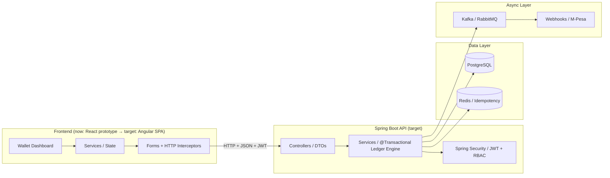
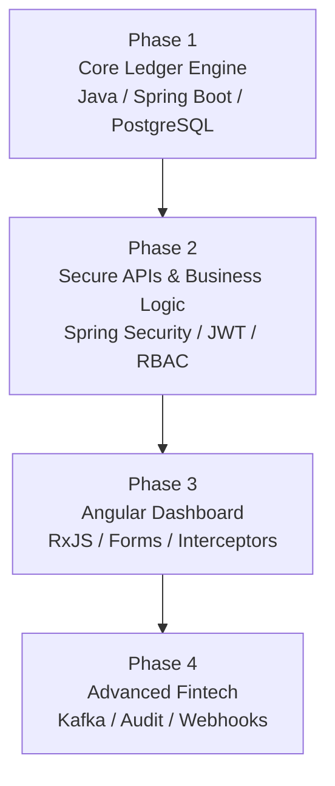

# EliteWallet — Fintech System

> A full-stack fintech platform: the current UI is a **React + Vite** prototype, with a
> documented conversion path to a **Spring Boot** REST API + ledger engine and an
> **Angular** dashboard, backed by PostgreSQL. The learning path follows the official
> [Spring Boot](https://roadmap.sh/spring-boot) and [Angular](https://roadmap.sh/angular)
> roadmaps, applied to a real financial product.

EliteWallet is a learning-by-building project. Instead of learning Spring Boot and
Angular in isolation, we build a real fintech platform step by step — multi-currency
wallets (KES, USD, BTC), a double-entry ledger, JWT security, dashboards, and async
integrations like M-Pesa webhooks.

## Table of Contents

- [Project Overview](#project-overview)
- [Tech Stack](#tech-stack)
- [Repository Structure](#repository-structure)
- [Getting Started](#getting-started)
- [Environment Variables](#environment-variables)
- [Backend API Contract](#backend-api-contract)
- [Angular + Spring Boot Conversion](#angular--spring-boot-conversion)
- [Roadmap](#roadmap)
- [Progress Tracking](#progress-tracking)

## Project Overview

The system has two halves:

- **Frontend (current):** a React + Vite prototype that covers the complete EliteWallet
  experience — Dashboard, Wallet, Markets, Buy/Sell, Send/Receive, Deposit/Withdraw
  (including M-Pesa STK Push), Transactions, Payments, Portfolio, Analytics, Statements,
  Notifications, Support, Security, Settings, and Profile. It runs fully on local mock
  data and switches to a real REST API when `VITE_API_BASE_URL` is set.
- **Backend (target):** a Spring Boot REST API that will own all business logic — the
  core ledger engine, JWT authentication with role-based access control, idempotent
  transfer endpoints, and async jobs.

The guiding principle: **Spring Boot owns the money.** No client-side database writes,
no business rules in the browser — the API is the only path to the ledger.



## Tech Stack

### Current prototype (this repo)

| Layer | Technology |
| --- | --- |
| Frontend | React 18, Vite 6, Tailwind CSS 3, shadcn/ui |
| Data / state | TanStack Query, React Router, Recharts |
| Integrations | M-Pesa Daraja (STK Push), Stripe, Base44 SDK (auth + functions) |
| Tooling | ESLint, TypeScript checking via JSDoc, npm |

### Target stack (Angular + Spring Boot)

| Layer | Technology | Why |
| --- | --- | --- |
| Backend | Java 21, Spring Boot 3, Spring MVC | REST API + business logic |
| Ledger | Spring Data JPA, Hibernate, Flyway | ORM + versioned schema migrations |
| Database | PostgreSQL | ACID guarantees, exact `NUMERIC` math, row locking |
| Cache / Idempotency | Redis | Prevents double charges, caches exchange rates |
| Security | Spring Security, JWT, BCrypt | Stateless auth + RBAC |
| Async | Kafka / RabbitMQ | Emails, PDF statements, notifications |
| Frontend | Angular 18+, TypeScript, RxJS | Enterprise dashboard SPA |
| UI | Tailwind CSS | Shared design system with the prototype |

## Repository Structure

```text
elitewallet/
|-- docs/
|   |-- backend-api-contract.md   # REST contract for the Spring Boot backend
|   `-- vscode-ai-prompts.md      # staged prompts for the Angular/Spring Boot port
|-- public/
|   `-- favicon.svg               # EliteWallet brand mark
|-- src/
|   |-- api/                      # Base44 client shim (auth + functions)
|   |-- components/               # shared UI + feature components
|   |-- hooks/
|   |-- lib/
|   |   |-- api/                  # configurable REST client + service layer
|   |   `-- mock/                 # demo data + mock service re-exports
|   |-- pages/                    # one page per route
|   `-- utils/
|-- index.html
|-- package.json
|-- tailwind.config.js
`-- vite.config.js
```

## Getting Started

### Prerequisites

- Node.js 18+ (tested with 20.x) and npm
- Git

### Install and run

```bash
npm install
npm run dev
```

The app will be available at `http://localhost:5173`.

### Try the demo

No environment variables or backend are required. With no `VITE_BASE44_APP_ID`
set, the prototype automatically runs in demo mode: open the homepage and click
**Explore demo dashboard** (or open `http://localhost:5173/app` directly) to
browse every wallet, trading, payment, analytics, and security screen on mock
data. On the login page, any email and password are accepted in demo mode.

### Useful commands

```bash
npm run dev         # start the Vite dev server
npm run build       # production build
npm run preview     # preview the production build
npm run lint        # ESLint (unused imports, hooks, JSX rules)
npm run typecheck   # TypeScript checking of the JS/JSX source
```

## Environment Variables

Copy the values you need into a `.env` file (none are required for the demo):

| Variable | Purpose |
| --- | --- |
| `VITE_API_BASE_URL` | When set, all service calls route to the Spring Boot REST API instead of mock data. |
| `VITE_DEMO_MODE` | Set to `true` to force standalone demo auth; leave unset and omit `VITE_BASE44_APP_ID` to auto-enable demo mode. |
| `VITE_BASE44_APP_ID` | Base44 app ID for hosted auth/functions. |
| `VITE_BASE44_APP_BASE_URL` | Base URL used for login redirects and the Base44 proxy. |
| `VITE_BASE44_FUNCTIONS_VERSION` | Functions version for the Base44 SDK. |

With no variables set, the app runs entirely on local mock data so development is never
blocked.

## Backend API Contract

[docs/backend-api-contract.md](docs/backend-api-contract.md) defines every endpoint,
DTO, and PostgreSQL table the frontend expects, including:

- Auth: register, login, refresh, forgot/reset password, `GET /auth/me`
- Wallet: balances, assets, portfolio history
- Transactions: list + detail with filters
- Trading: `POST /trading/quote` and `POST /trading/execute`
- Payments: transfers, beneficiaries, deposits (M-Pesa STK), withdrawals
- Markets, KYC, notifications, subscription, security, support, developer keys, invoices

Build the Spring Boot server to this contract and the Angular/Spring Boot port plugs
straight in.

## Angular + Spring Boot Conversion

[docs/vscode-ai-prompts.md](docs/vscode-ai-prompts.md) contains six staged, ready-to-paste
prompts for Cursor / GitHub Copilot / Windsurf:

1. Spring Boot skeleton + PostgreSQL schema (Flyway migrations)
2. REST controllers + DTOs matching the contract exactly
3. M-Pesa Daraja service (OAuth + STK Push + webhook callback)
4. Spring Security with JWT + per-user data isolation
5. Seed data mirroring `src/lib/mock/data.js`
6. Angular standalone app mirroring the React pages and routes

Run prompts 1–5 in the Spring Boot project folder and prompt 6 in a separate Angular
folder that proxies to the running backend.

## Roadmap

A 4-phase build sequence keeps the financial heart of the platform ahead of the UI:



| Phase | Focus | Deliverable |
| --- | --- | --- |
| 1 | Core ledger engine | Schema + Flyway, JPA entities, `@Transactional` transfers, double-entry validation, pessimistic locking |
| 2 | Secure APIs | JWT auth, BCrypt, RBAC, idempotency with Redis, validation + error handling |
| 3 | Angular dashboard | Standalone components, RxJS state, HTTP interceptor, route guards, multi-step transfer forms |
| 4 | Enterprise capabilities | Async jobs, audit log, M-Pesa/crypto webhooks, Docker, CI/CD, deployment |

### 12-week plan

| Week | Focus | Deliverable |
| --- | --- | --- |
| 1 | Java + Git + TypeScript foundations | Repo scaffold, README, first commits |
| 2 | Spring Core + first REST API | `/api/v1/health` endpoint |
| 3 | PostgreSQL schema + Flyway | Versioned migrations |
| 4 | Ledger engine | Transfer + double-entry + locking |
| 5 | Security + JWT + RBAC | Auth endpoints + protected routes |
| 6 | Idempotency + Redis | Retry-safe transfer endpoint |
| 7 | Angular setup + components | UI shell + dashboard page |
| 8 | Services + HTTP + interceptor | Wallet list from the API |
| 9 | Forms + routing | Multi-step transfer flow UI |
| 10 | RxJS + state | Live balances + exchange rates |
| 11 | Async + audit + webhooks | Broker jobs, M-Pesa mock |
| 12 | Testing + deploy | Backend/frontend tests, live demo |

## Progress Tracking

- [x] React prototype (EliteWallet) — 20+ pages, mock service layer, M-Pesa STK push
- [x] Backend API contract + VS Code AI prompts documented
- [ ] Spring Boot skeleton + PostgreSQL schema (prompt 1)
- [ ] REST controllers + DTOs (prompt 2)
- [ ] M-Pesa Daraja service (prompt 3)
- [ ] JWT security + per-user isolation (prompt 4)
- [ ] Seed data matching the mock (prompt 5)
- [ ] Angular frontend (prompt 6)
- [ ] Async jobs, webhooks, Docker, CI/CD, live deployment

---

**Demo notice:** this prototype is not a licensed financial service. Real transaction
settlement, custody, KYC processing, and market data are deliberately out of scope until
the Spring Boot backend and licensed integrations are in place.
